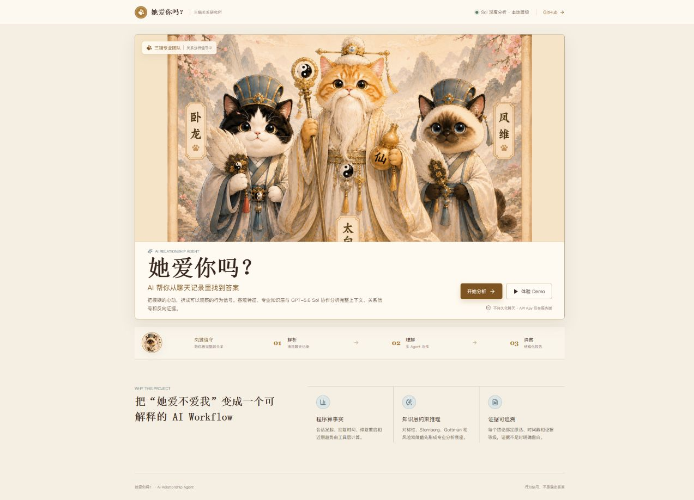
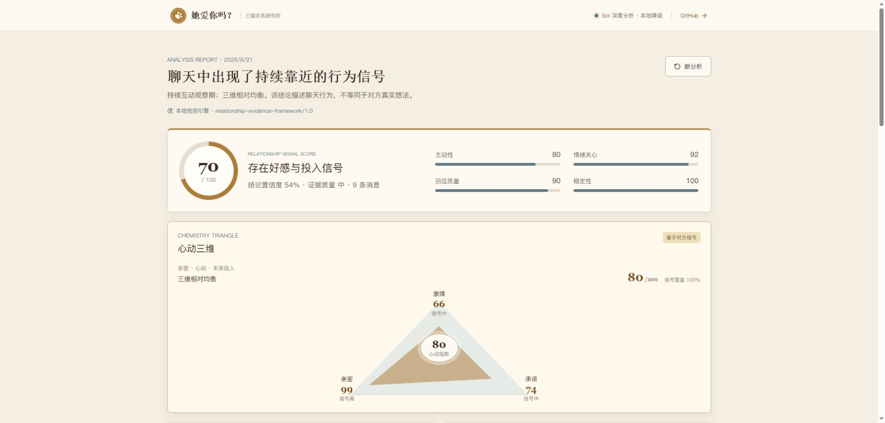

# 她爱你吗？—— AI Relationship Agent

一个真实运行的关系行为分析 Web App。用户上传或粘贴聊天记录后，系统依次执行 Chat Parser、客观 Feature Extraction、专业关系 Knowledge Layer，再由 GPT-5.6 Sol 阅读连续时间线并完成证据优先的综合推理，最后输出带原话、时间戳、反向证据和分析限制的结构化报告。

> 这不是“输入一句话 + 一段 Markdown”。Tools 计算可复现事实，Knowledge Layer 提供专业框架和判断纪律，GPT-5.6 Sol 负责完整上下文中的语义理解与综合判断，结果由 Structured Outputs 和服务器端证据回查共同约束。

## Product Preview

<p align="center">
  
</p>

<p align="center">
  
</p>

> Screenshots are captured from the deployed Demo. The report view shows the evidence-first score, Chemistry Triangle, traceable evidence, and Fengchu deep reasoning in one structured result.

## Demo

本地启动后点击「体验 Demo」即可使用虚拟数据，无需模型或 API Key。开发地址为 `http://localhost:5173`；生产构建由 `http://localhost:8787` 同时提供 Web App 和 API。

## Features

- Sternberg 三角综合评分：融合激情、亲密、承诺，并单独显示证据覆盖度，避免把缺失证据误算成低分
- 结构化“军师建议”和反思性“祖师爷寄语”，参考 Skill 的趣味报告体验并按本项目证据纪律重新设计
- 可测试的称呼信号规则：亲密称呼作为明确高权重喜欢信号，姐姐 / 哥哥 / 爸爸 / 主人 / 小狗等直接角色称呼加 30 分；普通亲属或宠物叙述不会误触发
- 原创“祖师爷寄语”情境库，按高甜、暧昧、升温、观望、低投入与边界风险匹配，不直接复制平台文案
- 原创“军师建议”策略库，吸收短视频高传播建议的简洁、反差和行动导向表达，按称呼、双向投入、计划兑现、失衡与风险情境匹配

- 粘贴聊天文本，上传 TXT / CSV / JSON，或直接导入多张聊天截图
- 浏览器端 PaddleOCR 中文 / 英文识别：支持文件选择、拖放、剪贴板粘贴、排序和删除
- 根据微信气泡位置推断说话人（左侧为对方、右侧为我），支持一键交换
- 截图添加后只需点击一次「开始分析」；浏览器在后台完成 OCR、质量检查并自动进入 Agent Workflow
- 识别详情默认折叠，仅在质量不合格时展开供用户修正，低置信乱码不会进入关系分析
- 自动去除相邻截图中完全相同的重叠消息，图片不会进入分析 API
- 时间戳归一化、3 小时会话切分、发起次数、有效回复时间、连续追发、24 小时沉默后重启
- 信号束分析：识别通话 / 语音 / 视频时长等高成本时间投入，并判断直接爱意是否发生在真实互动、生活关心或情绪靠近之后；同时把当下升温与长期稳定投入分开校验
- 近 30 天消息密度波动、互动趋势、代词、模糊词、条件句、关心和未来计划特征
- 方向性关系信号层：只把对方（`them`）的主动情感表达、主动延续、分享、关心、见面推进计入“对方靠近”；用户自己的“爱你 / 想你”单独记录为用户投入
- S / A / B / C / negative 信号等级、语言亲密度、行为亲密度、主动性、关系推进、近 7 / 30 天与全历史评分，每条信号绑定真实原话
- 「凤雏分析」高级推理：按关系核心判断、深层解读、关键证据、隐藏洞察、非凡建议和 Highlight 六段输出，在 500 字内完成证据权重、歧义解释与可验证行动建议
- 起源 / 冲突 / 近期 / 修复四类证据窗口，统计层仍基于全量数据
- 对称性推导、Sternberg 关系三角、Gottman 沟通候选、关系阶段、沟通循环和情感可得性
- 风险双阈值：量化条件与文本条件同时满足才高亮；否则降级为观察提示
- Emotion / Interaction / Risk / Relationship / Report 五个 Agent
- 每个结论绑定证据等级；敏感推断证据不足时明确留白
- NDJSON 流式 Workflow 状态与结构化 Dashboard
- OpenAI Responses API + GPT-5.6 Sol（默认 `high` reasoning），一次深度综合推理而非堆叠云模型调用
- 无 OpenAI Key 或请求失败时自动使用原有 Ollama / 确定性 fallback，Demo、上传和 Dashboard 保持可用

## Signal Weighting and Evaluation

关键词只负责发现候选证据，不能单独决定结论。强信号（主动情感表达、明确关系推进、持续照顾、可验证的高成本时间投入）会与中强、弱和反向信号一起按上下文、频率、时间跨度和双方对等程度加权。对方主动说出的内容会标记为 `spontaneous`；在用户表达之后的回应会标记为 `reactive`，两者不会同权。

统一的 Relationship Signal Ledger 会记录 `signal`、`strength`、`confidence`、`direction`、`initiator`、`responder`、`spontaneous`、`reactive`、`messageId`、`quote`、`contextMessageIds` 和 `reason`。每个重要信号都带有前后动态窗口；Sol 读取完整时间顺序，超长记录按时间段采样，同时保留首尾和每一段边界，避免简单截断后半段。

“对方喜欢倾向”与“聊天亲密度”是两个独立结果。喜欢倾向综合主动性、情感表达、时间投入、关心照顾、暧昧、关系推进、特殊性、稳定性和反向信号，并保留 supporting / counter evidence。服务端逐字校验 `messageId + quote + speaker + timestamp`，模型编造的证据会被丢弃。

`server/evaluation-dataset.ts` 和 `server/evaluation.test.ts` 是虚拟评估集，不包含真实聊天记录，覆盖明显喜欢、普通朋友、暧昧期、单方面喜欢、情侣、关系降温、玩梗型“爱你”和明确拒绝。它们用于回归检查：明显暧昧证据不能被机械判成“信息不足”，单方面投入和玩梗不能被误判为对方喜欢，明确拒绝和近期降温必须保留为反向信号。

## Agent Architecture

```text
Chat text / TXT / CSV / JSON / screenshots
              |
 Browser OCR (screenshots only)
  - image decoding + text recognition
  - left/right speaker inference
  - overlap removal + quality gate
  - optional editable review on failure
              |
          Chat Parser
              |
  Feature Extraction (Tools, full dataset)
  - sessions / reply latency / repair starts
  - recent trend / linguistic counters
  - them-to-me signal direction + S/A/B/C grading
  - language intimacy / behavior intimacy / initiative / progress
  - origin / conflict / recent / repair windows
              |
  Professional Relationship Knowledge Layer
  - evidence discipline + evidence quality
  - symmetry / Sternberg / Gottman
  - stage / communication cycle / availability
              |
  GPT-5.6 Sol Deep Analysis (Responses API)
  - full chronological context when it fits
  - balanced time-segment sampling when oversized
  - supporting + counter evidence
  - emotion / interaction / risk / relationship / report
  - Fengchu advanced subtext analysis (<= 500 Chinese chars)
  - high reasoning + Structured Outputs
              |
  Zod-validated AnalysisReport JSON
  + exact quote / speaker / timestamp grounding
              |
        React Web Dashboard
```

Sol 会同时接收客观指标、专业 Knowledge Layer 和按时间顺序排列的聊天内容，并在一个质量优先的深度分析调用中完成 Emotion、Interaction、Risk、Relationship、Report 与凤雏分析的综合推理。凤雏分析不会增加第二次模型请求；它在同一份 Structured Output 中结合强 / 中强 / 弱 / 反向证据、频率、持续时间和投入对等度做二次推理。Knowledge Layer 只提供方法论参考，不直接决定结论。所有引用都必须通过服务器端 `messageId + quote + speaker + timestamp` 精确回查；凤雏引用失真或超过 500 字时会单独切换到确定性证据 fallback，不影响其余已通过校验的 Sol 结果。确定性风险双阈值仍作为本地安全基线保留。

## Workflow Contracts

| Layer | Responsibility | Output |
| --- | --- | --- |
| Parser | 清洗、多格式兼容、说话人和时间线归一化 | `ChatMessage[]` |
| Tools | 对全量数据做确定性统计与关键窗口抽取 | `FeatureSet` |
| Knowledge | 应用关系框架、证据等级和判断规则 | `KnowledgeResult` |
| Sol Deep Analysis | 阅读连续时间线，综合情绪、互动、风险、关系信号、支持与反向证据，并生成凤雏六段分析 | `SolRelationshipAnalysis` |
| Adapter / Report | 回查证据并映射到现有 Dashboard 合约 | `AnalysisReport` |

## Methodology Reference

本项目的方法论参考了 GitHub 项目 [863401402/she-love-me](https://github.com/863401402/she-love-me) 中的 Agent Skill（MIT License），尤其是以下思路：

- 全量客观统计与分层叙事采样分离
- 起源、高冲突、近期、修复时刻四类证据窗口
- “无证据不推断”和证据不足留白
- 互动对称性、Sternberg 三角、Gottman 沟通模式与修复尝试
- 风险信号的量化 + 文本双阈值和降级观察机制
- 建议需要绑定具体聊天行为，而不是输出泛化鸡汤

本项目没有复制原 Skill 的脚本或报告生成器，而是围绕 Web API 和 TypeScript 数据契约重新设计并实现：

- 重写为 TypeScript Feature Engine、Knowledge Layer 和流式 Agent Orchestrator
- 使用 Zod 作为前后端共享结构化输出边界
- 加入时间戳覆盖率、样本量和跨度驱动的证据质量评分
- 所有框架结论携带证据等级、原话锚点和替代解释
- 风险高亮由确定性代码控制，LLM 只能解释，不能自行触发
- 将 Skill 限定为知识参考层，最终语义判断由 GPT-5.6 Sol 完成
- 增加长上下文时间线、反向证据、概率性结论和逐字证据回查
- 移除了人格定论、模仿名人语气、贬损标签、操控式关系策略和强制断联倒计时
- 将“她爱你的概率”重新定义为“聊天中可观察的关系信号分数”

这种设计保留了 Skill 的专业分析纪律，同时更适合隐私敏感、可测试、可部署的 Web 产品。

## Tech Stack

- React 18 + TypeScript + Vite
- PaddleOCR PP-OCRv6 + ONNX Runtime Web（浏览器本地中英文识别）
- Express + TypeScript + Zod
- OpenAI Responses API + `gpt-5.6-sol` + Structured Outputs
- Ollama local structured JSON（可选）
- NDJSON streaming API
- Node test runner + ESLint

## Installation

```bash
npm install
copy .env.example .env
npm run dev
```

本机无需 OpenAI 订阅。安装 [Ollama](https://ollama.com/download) 后先下载默认模型：

```bash
ollama pull qwen3:1.7b
```

`.env.example` 已默认启用本地 Ollama。聊天文字只会发送到本机的 `127.0.0.1:11434`；模型不可用时，工作流会自动使用确定性证据分析，Demo 和 Dashboard 仍然可运行。

生产构建与启动：

```bash
npm run build
npm start
```

## Deployment

项目包含 [render.yaml](./render.yaml)，可以直接部署到 Render：

1. 将项目推送到 GitHub。
2. 在 Render 选择 `New +` → `Blueprint`，连接这个 GitHub 仓库。
3. Render 会读取 `render.yaml`，自动执行 `npm ci && npm run build` 和 `npm start`。
4. 云端 Render 无法直接访问你电脑上的 Ollama；如需云端 AI 推理，需要为服务器配置兼容的模型服务，未配置时会自动使用确定性证据分析。

部署完成后会得到一个稳定的 `https://she-love-me-ai.onrender.com` 类似地址。该地址在服务持续存在时保持不变，也可以在 Render 的 Custom Domains 中绑定自己的域名。免费实例可能在无访问一段时间后休眠，首次打开需要等待冷启动；如果需要持续在线，升级实例计划即可。不要把任何模型服务密钥写进 GitHub、前端代码或 `render.yaml`。

质量检查：

```bash
npm test
npm run typecheck
npm run lint
```

## Environment Variables

| Variable | Required | Description |
| --- | --- | --- |
| `PORT` | No | Backend port, default `8787` |
| `OPENAI_ENABLED` | No | Set to `true` only when using an official server-side OpenAI API key; local default `false` |
| `OPENAI_API_KEY` | For Sol | Server-only OpenAI API key. Never expose it through Vite or commit `.env` |
| `OPENAI_MODEL` | No | Deep-analysis model, default `gpt-5.6-sol` |
| `OPENAI_REASONING_EFFORT` | No | Responses API reasoning effort, default `high` |
| `OPENAI_TIMEOUT_MS` | No | Sol request timeout, default `240000` |
| `OPENAI_MAX_CONTEXT_CHARACTERS` | No | Full-context character budget before balanced chronological sampling, default `800000` |
| `OLLAMA_ENABLED` | No | Set to `true` to enable local LLM agents |
| `OLLAMA_BASE_URL` | No | Must remain localhost; default `http://127.0.0.1:11434` |
| `OLLAMA_MODEL` | No | Local model name, default `qwen3:1.7b` |

## Project Structure

```text
src/                    React workflow UI and structured dashboard
src/ScreenshotInput.tsx Screenshot queue, clipboard/drop input and OCR review
src/ocr.ts              PaddleOCR browser pipeline, speaker inference and overlap removal
server/parser.ts        TXT / CSV / JSON parsing and basic metrics
server/features.ts      Objective full-dataset feature extraction
server/signals.ts       Directional relationship signals and evidence grades
server/evaluation-dataset.ts  Eight virtual relationship evaluation cases
server/evaluation.test.ts    Ledger, liking, regression, and anti-overinterpretation tests
server/fengchu.ts       Evidence-weighted Fengchu reasoning and <=500-char deterministic fallback
server/knowledge.ts     Professional frameworks and evidence discipline
server/agents.ts        Five deterministic agent fallbacks and risk gate
server/openai.ts        GPT-5.6 Sol Responses API, long-context builder and grounded Structured Output
server/sol-adapter.ts   Sol deep analysis to existing Dashboard contract
server/workflow.ts      Agent orchestration, Sol-first analysis and fallbacks
server/index.ts         Express API and NDJSON workflow stream
shared/types.ts         Frontend/backend structured output contracts
```

## Privacy / Disclaimer

默认 Ollama 模式下，聊天文字由后端发送到本机 `127.0.0.1:11434`，不会上传到 OpenAI；浏览器截图本身也不会离开本机。只有主动启用 GPT-5.6 Sol 时，整理后的聊天文字、客观指标和专业框架才会由后端发送到 OpenAI Responses API。项目使用 `store: false`，但部署者仍应依据相关数据政策和自身隐私要求决定是否启用，并在处理真实聊天前取得必要同意。模型不可用时，应用自动使用本地确定性分析，Demo、上传和 Dashboard 仍可运行。

Demo 数据为虚拟内容。应用不会持久化聊天记录，API 只在当前运行进程内处理请求。聊天截图由 PaddleOCR + ONNX Runtime Web 在浏览器内解码和识别，图片文件不会上传到后端；提交 Agent Workflow 时只发送整理后的文字。首次使用会从模型 CDN 下载 PP-OCRv6 模型和约 27 MB 的 WASM 运行时，之后浏览器可复用缓存。启用 Ollama 时，聊天文字只发送到配置的本机回环地址。请勿提供身份证、住址、账号等无关敏感信息。

OCR 会受到截图分辨率、主题、字体、表情和语音 / 图片消息影响。说话人通过气泡横向位置推断，默认左侧为对方、右侧为我。正常情况下 OCR 是「开始分析」按钮内部的自动步骤；低置信行会被质量门过滤，不会发送给 Agent。只有整体识别质量不合格时才会停止并展开可编辑详情。相邻截图中完全相同的重叠行会自动去重，部分重叠或 OCR 结果不一致时仍可能需要人工处理。

AI 分析仅基于用户提供的聊天行为和语言信号，不构成心理诊断，也无法确定他人的真实想法。依恋、沟通循环、风险等框架均为带证据等级的观察假设，不应替代现实沟通或专业帮助。

## License

本项目采用 MIT License。方法论参考项目的版权仍归其原作者所有，详见其 [LICENSE](https://github.com/863401402/she-love-me/blob/main/LICENSE)。
